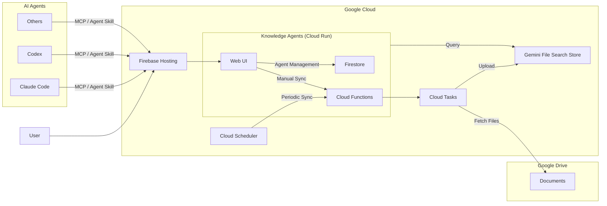

# Knowledge Agents

A web application that integrates Google Drive documents with Gemini File Search Store, providing a knowledge base as MCP servers and Agent skills.

## System Overview



## Prerequisites

- Node.js (see `.node-version` for version)
- pnpm (see `packageManager` in `package.json` for version)
- Firebase CLI
- gcloud CLI

> **Note**: This project is configured for `asia-northeast1` region. To use a different region, search for `asia-northeast1` in the codebase and replace it with your preferred region before setup.

## GCP Project Setup

### 1. Create and Configure Firebase Project

Configure the following in the [Firebase Console](https://console.firebase.google.com/):

1. Create a new Firebase project
2. Add a web app
3. Upgrade to Blaze plan
4. Set up Firestore Database
5. Set up Authentication
   - Upgrade to Identity Platform
   - Enable Google provider

### 2. gcloud CLI Setup

```bash
# Install gcloud CLI (if not installed)
# https://cloud.google.com/sdk/docs/install

# Authenticate
gcloud auth login
```

### 3. Enable Required GCP Services

```bash
gcloud services enable \
  cloudbuild.googleapis.com \
  cloudfunctions.googleapis.com \
  artifactregistry.googleapis.com \
  run.googleapis.com \
  eventarc.googleapis.com \
  secretmanager.googleapis.com \
  cloudscheduler.googleapis.com \
  cloudtasks.googleapis.com \
  pubsub.googleapis.com \
  storage.googleapis.com \
  identitytoolkit.googleapis.com \
  drive.googleapis.com \
  --project YOUR_PROJECT_ID
```

### 4. Generate Service Agent Identities

Generate service agent identities to avoid permission propagation delays during first deployment:

```bash
gcloud beta services identity create --service=pubsub.googleapis.com --project YOUR_PROJECT_ID
gcloud beta services identity create --service=eventarc.googleapis.com --project YOUR_PROJECT_ID
```

> **Note**: Wait 1-2 minutes after running these commands before proceeding to allow permissions to propagate.

### 5. Register Secrets in Secret Manager

Register the following secrets in Secret Manager:

| Secret Name                 | Description                             | How to Obtain                                             |
| --------------------------- | --------------------------------------- | --------------------------------------------------------- |
| `GEMINI_API_KEY`            | Gemini API Key                          | Get from [Google AI Studio](https://aistudio.google.com/) |
| `AUTH_TOKEN_ENCRYPTION_KEY` | Auth token encryption key (32-byte Hex) | Generate with `openssl rand -hex 32`                      |

Create secrets in [Secret Manager](https://console.cloud.google.com/security/secret-manager).

### 6. Configure IAM Permissions

Configure the following in IAM on the [GCP Console](https://console.cloud.google.com/):

| Target                          | Role                           | Purpose                            |
| ------------------------------- | ------------------------------ | ---------------------------------- |
| Default compute service account | Secret Manager Secret Accessor | Cloud Run access to Secret Manager |
| Developer account               | Service Account Token Creator  | Authentication during deployment   |

### 7. Repository Configuration

#### 7.1. Set Project ID in `.firebaserc`

```json
{
  "projects": {
    "default": "YOUR_PROJECT_ID",
    "test": "demo-test-project",
    "dev": "demo-dev-project"
  }
}
```

#### 7.2. Create Environment Variable Files

```bash
# Root
cp -p .env.sample .env.default

# Cloud Functions
cp -p services/functions/.env.sample services/functions/.env.default

# Scripts
cp -p scripts/.env.sample scripts/.env.default
```

#### 7.3. Configure Environment Variables

**Root `.env.default`**

| Environment Variable                             | Description                                       |
| ------------------------------------------------ | ------------------------------------------------- |
| `NEXT_PUBLIC_ENVIRONMENT`                        | `production`                                      |
| `NEXT_PUBLIC_FIREBASE_API_KEY`                   | Firebase API Key                                  |
| `NEXT_PUBLIC_FIREBASE_AUTH_DOMAIN`               | Firebase Auth Domain                              |
| `NEXT_PUBLIC_FIREBASE_PROJECT_ID`                | Firebase Project ID                               |
| `NEXT_PUBLIC_FIREBASE_MESSAGING_SENDER_ID`       | Firebase Messaging Sender ID                      |
| `NEXT_PUBLIC_FIREBASE_APP_ID`                    | Firebase App ID                                   |
| `NEXT_PUBLIC_GOOGLE_DRIVE_SERVICE_ACCOUNT_EMAIL` | Service account for Google Drive integration (\*) |

(\*) Check the email address of "Default compute service account" in [GCP Console](https://console.cloud.google.com/) > IAM & Admin > Service Accounts

**Cloud Functions `services/functions/.env.default`**

| Environment Variable | Description  |
| -------------------- | ------------ |
| `ENVIRONMENT`        | `production` |

**Scripts `scripts/.env.default`**

| Environment Variable             | Description                               |
| -------------------------------- | ----------------------------------------- |
| `ENVIRONMENT`                    | `production`                              |
| `DEV_GOOGLE_SERVICE_ACCOUNT`     | Default compute service account           |
| `SCRIPTS_GOOGLE_SERVICE_ACCOUNT` | Service account for script execution (\*) |
| `FIREBASE_PROJECT_ID`            | Firebase Project ID                       |

(\*) Create a service account with the following roles in [GCP Console](https://console.cloud.google.com/) > IAM & Admin > Service Accounts:

- Firebase Admin SDK Administrator Service Agent
- Secret Manager Secret Accessor
- Service Account Token Creator

### 8. Configure Budget Alert (Optional)

It is recommended to set up a budget alert to monitor costs. Configure in [Budgets & alerts](https://console.cloud.google.com/billing/budgets) in the Google Cloud Console.

### 9. Installation and Deployment

```bash
# Install packages
npm install -g pnpm firebase-tools
pnpm install

# Firebase authentication
firebase login

# Build shared packages
pnpm build:shared
```

#### 9.1. Deploy Cloud Functions

```bash
pnpm deploy:default:functions
```

> **Note**: On first deployment, permission propagation for 2nd Gen Cloud Functions may take time, causing some Functions to fail. Wait a few minutes and run `pnpm deploy:default:functions` again.

#### 9.2. Deploy Web Application

```bash
pnpm deploy:default:web
```

> **Note**: On first Cloud Run deployment, you will be asked `Allow unauthenticated invocations to [app] (y/N)?`. Select `y` to publish as a web application.

#### 9.3. Create Admin User

Create an admin account to access the admin panel (`/admin`).

```bash
pnpm node:default scripts/src/createAdminUser.ts -e your-email@example.com
```

> **Note**: After running the script, sign in with Google using the registered email address.
>
> **Troubleshooting**: If sign-in fails with an error, blocking functions may not have been configured automatically during deployment. Go to [Firebase Console](https://console.firebase.google.com/) > Authentication > Settings > Blocking functions, and manually register `beforeUserCreated` and `beforeUserSignedIn` functions.

## Notes

- Chat streaming responses do not work through Firebase Hosting (SSE is blocked due to reverse proxy specifications, but chat itself is available). To use streaming, access Cloud Run directly, via Cloud Run Domain Mapping, or use App Hosting.
